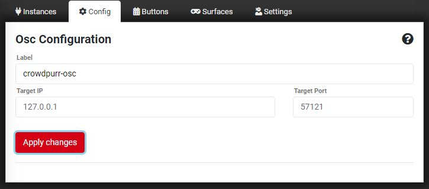

# CpOSC
CpOSC allows you to control a [Crowdpurr](https://www.crowdpurr.com) experience using any Open Sound Control (OSC) client. I did this by wrapping the Crowdpurr webapp in an Electron app that hosts a OSC server that interacts with the webappp. My ultimate goal was to control Crowdpurr using an Elgato Stream Deck.

> I was inspired by [Andy Carluccio](https://www.andycarluccio.com/)'s [ZoomOSC](https://www.liminalet.com/zoomosc), which he mentioned during the [December 5th episode](https://www.youtube.com/watch?v=2HfgIKJLyEs) of [@AlexLinday](https://www.twitter.com/alexlindsay)'s [Office Hours](https://www.youtube.com/office).

# TO DO
- Add LiveStream action
- Add CI/CD and release management

## Using with an OSC client
Clients should connect to CpOSC's server on UDP port 57121. See list of available actions below.

## Using with Stream Deck / Bitfocus Companion
I use [Bitfocus Companion](https://github.com/bitfocus/companion) with my Stream Deck. To configure Companion to talk to CpOSC:
- add an OSC:Generic instance
- configure the OSC:Generic instance with the target IP (use 127.0.0.1 if on the same system) and target port 57121

- add a "Send message without arguments" action to a "Regular Button" with the corresponding OSC Path (see available actions below)

> I've incuded a [sample Companion configuration file](streamdeck/cposc.companionconfig). It inclcudes a page of buttons with all the actions listed bellow. When import it make sure you select the Generic:OSC instance you added and configured earlier.

# Crowdpurr Experience Actions

## Launching Views
Action | OSC Path
--- | ---
Launch Projector View | /cposc/launchProjectorView 
Launch Mobile View | /cposc/launchMobile

## Experience Management
Action | OSC Path
--- | ---
Start Experience | /cposc/startExperience
Finish Experience | /cposc/finishExperience
Reset Experience | /cposc/restartExperience
Pause Experience | /cposc/pauseExperience
Unpause Experience | /cposc/unPauseExperience
Trigger Next Round | /cposc/triggerNextRound

## Game Play
Action | OSC Path
--- | ---
startQuestion | /cposc/startQuestion
previousQuestion | /cposc/previousQuestion
nextQuestion | /cposc/nextQuestion
showAnswerResults | /cposc/showAnswerResults
showCorrectAnswer | /cposc/showCorrectAnswer
showQuestionNote | /cposc/showQuestionNote
showRankings | /cposc/showRankings
showMultiGameRankings | /cposc/showMultiGameRankings
showTeamRankings | /cposc/showTeamRankings

# Notice of Non-Affiliation and Disclaimer
I am not affiliated, associated, authorized, endorsed by, or in any way officially connected with [Crowdpurr](https://www.crowdpurr.com), or any of its subsidiaries or its affiliates. The official Crowdpurr website can be found at https://www.crowdpurr.com.

The name Crowdpurr as well as related names, marks, emblems, logos, images and brands areregistered trademarks and the property of their respective owners.

# Other disclaimers
This work was created under a [Creative Commons Zero v1.0 Universal](LICENSE) (CC0) license. You can copy, modify, distribute and perform this work, even for commercial purposes, all without asking permission.

In no way are the patent or trademark rights of any person affected by CC0, nor are the rights that other persons may have in the work or in how the work is used, such as publicity or privacy rights.

The use of a work free of known copyright restrictions may be otherwise regulated or limited. The work or its use may be subject to personal data protection laws, publicity, image, or privacy rights that allow a person to control how their voice, image or likeness is used, or other restrictions or limitations under applicable law.

Unless expressly stated otherwise, I make no warranties about this work, and disclaim liability for all uses of this work, to the fullest extent permitted by applicable law.

When using or citing the work, you should not imply endorsement by the author or the affirmer. In some jurisdictions, wrongfully implying that an author, publisher or anyone else endorses your use of a work may be unlawful.